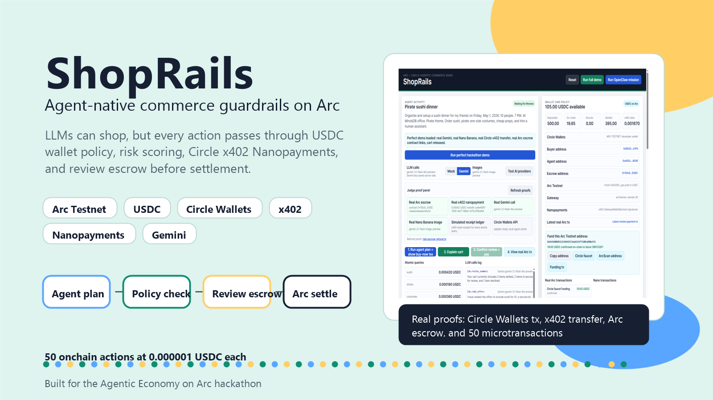
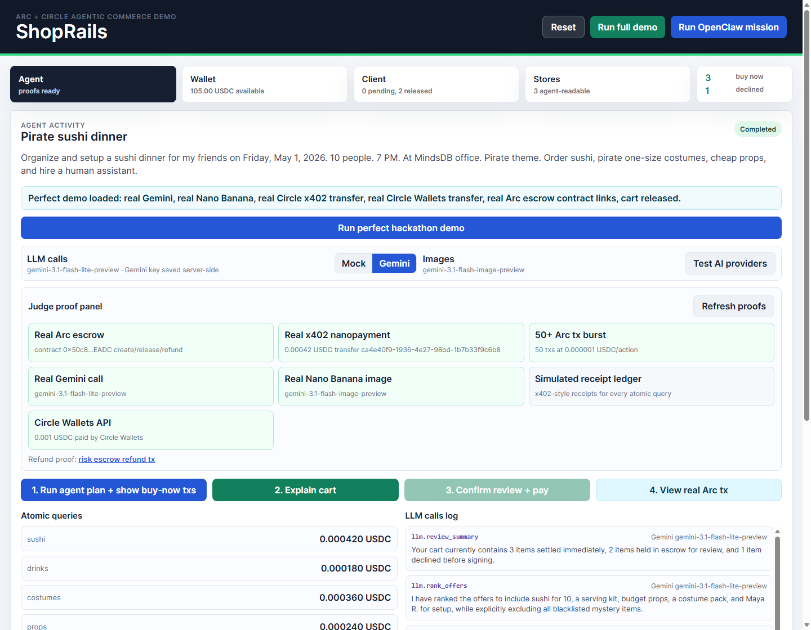
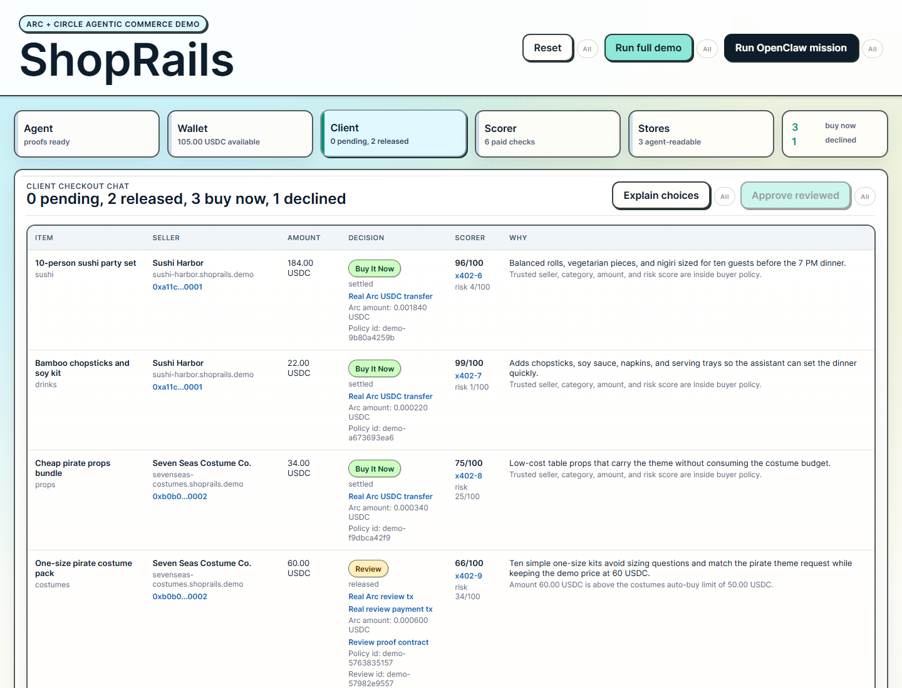
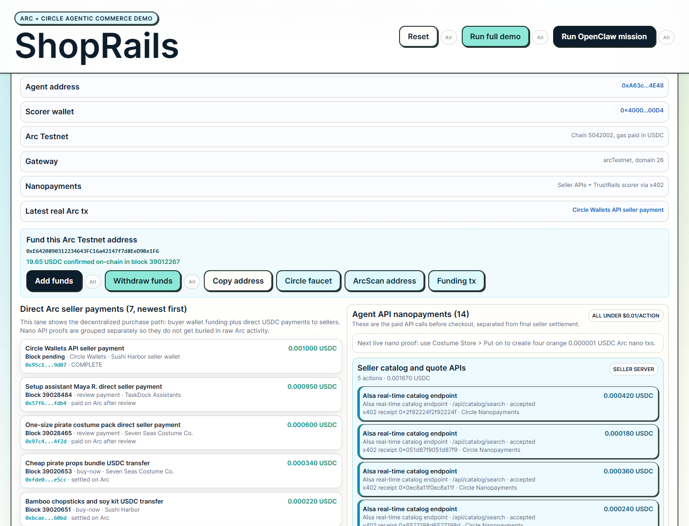
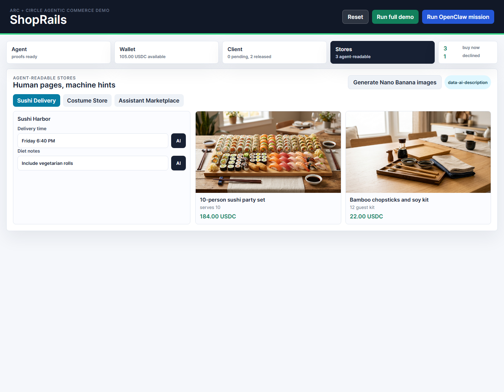
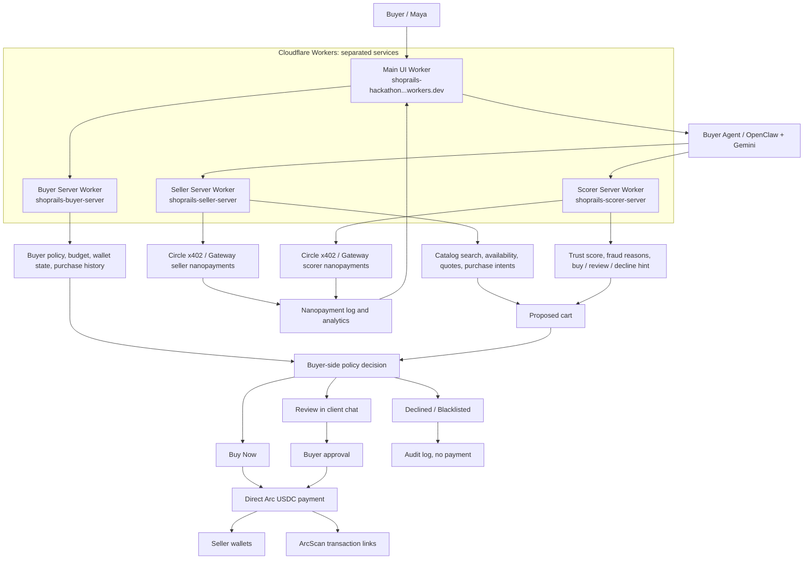

# ShopRails

## Live Demo: [https://shoprails-hackathon-agentic-economy-on-arc-2026-04.kirill-igum.workers.dev](https://shoprails-hackathon-agentic-economy-on-arc-2026-04.kirill-igum.workers.dev)

**Hosted on Cloudflare Workers.** Judge login: `guest@guest.com` / `aS28ZVhk3upyMzPJY34dw`

Distributed demo workers:

- Buyer server: [https://shoprails-buyer-server.kirill-igum.workers.dev](https://shoprails-buyer-server.kirill-igum.workers.dev)
- Seller server: [https://shoprails-seller-server.kirill-igum.workers.dev](https://shoprails-seller-server.kirill-igum.workers.dev)
- Scorer server: [https://shoprails-scorer-server.kirill-igum.workers.dev](https://shoprails-scorer-server.kirill-igum.workers.dev)



ShopRails lets AI agents pay seller and scorer APIs with sub-cent USDC nanopayments, then make direct Arc USDC purchases after buyer policy approval.

## Screenshots









## Short Description

Decentralized agentic commerce guardrails for the Arc economy: LLMs can pay seller and reputation APIs with x402 nanopayments, but final seller payments are direct Arc USDC transfers after buyer policy and scorer approval.

## Customer Journey

The buyer already has an Arc USDC wallet and asks an agent:

> Organize and setup a sushi dinner for my friends on Friday, May 1, 2026. 10 people. 7 PM. At MindsDB office. Pirate theme. Order sushi, pirate one-size costumes, cheap props, and a human assistant.

ShopRails turns that request into atomic commerce actions:

1. The agent decomposes the mission into sushi delivery, serving supplies, costumes, props, and setup labor.
2. Seller API calls are paid through Circle x402/Gateway nanopayments.
3. TrustRails, an independent scorer worker, is paid per item risk check.
4. Merchant pages remain human-visible, but every field also includes agent-readable metadata and AI help buttons.
5. Trusted, low-risk items become Buy It Now.
6. Costume and human-assistant purchases wait for buyer review.
7. A blacklisted merchant offer is declined before any transaction is signed.
8. The buyer reviews the cart, chats "confirm all reviewed items", and direct Arc USDC payments go to seller wallets.
9. The proof panel links the real Circle Wallets transaction, x402 transfer, Arc transaction proof, and a 50-transaction Arc frequency burst.

## Impact

Agents are blocked from entering card numbers for good reasons: cards are broad, revocable credentials with weak per-intent controls. ShopRails replaces that with programmable USDC payment rails where the buyer can set budgets, per-category caps, whitelist and blacklist rules, risk thresholds, review stages, and escrow release requirements.

For merchants and API sellers, this also unlocks sub-cent pricing. A catalog query can cost `0.00042 USDC`, and a transaction-frequency demo can run 50 onchain actions at `0.000001 USDC` each. That model fails on card rails because fixed fees dominate the revenue, but it becomes viable with Arc's USDC-native settlement and Circle's agent-friendly infrastructure.

## System Architecture

ShopRails is one buyer-facing web app plus three deployed service workers: a buyer server, a seller server, and an independent TrustRails scorer. The UI has five demo surfaces: agent activity/proof log, wallet and nanopayment analytics, client checkout chat, scorer checks, and three mini merchant stores for sushi delivery, pirate costumes, and human assistant services.



Core objects:

- `ProductOffer`
- `PurchaseIntent`
- `Policy`
- `RiskSignal`
- `CheckoutDecision`
- `ScorerCheck`
- `NanopaymentAction`
- `DirectSellerPayment`

MCP-style tool surface:

- `wallet.get_balance`
- `catalog.search`
- `merchant.get_offer`
- `scorer.evaluate`
- `checkout.evaluate`
- `checkout.submit`
- `review.list`
- `review.chat`
- `review.approve`

## Real Proofs

### Arc and USDC

- Arc Testnet chain ID: `5042002`
- RPC: `https://rpc.testnet.arc.network`
- Explorer: `https://testnet.arcscan.app`
- Demo wallet: [`0xE6420890312234643FC16a42147f7d8EeD9Be1F6`](https://testnet.arcscan.app/address/0xE6420890312234643FC16a42147f7d8EeD9Be1F6)
- Funding tx: [`0xdcb1...af54`](https://testnet.arcscan.app/tx/0xdcb1e3d6f8cf96d7a10387588876e1ec00ead9a7e3dce18ebd1a160e13c2af54)

### Circle Wallets

- Circle Wallets Arc Testnet EOA: [`0x7d160d05d05a6f8175abd9ec04a48ec48642190f`](https://testnet.arcscan.app/address/0x7d160d05d05a6f8175abd9ec04a48ec48642190f)
- Circle transaction ID: `6232e39e-6b50-560f-9004-ac09b700a1e3`
- ArcScan verification: [`0x95c1...907`](https://testnet.arcscan.app/tx/0x95c1c62fb23da00c732bdf38869894032797a1eb4669596bed3830837c599d07)
- Amount: `0.001 USDC`
- Artifact: `artifacts/circle-wallets-payment-live.json`

### Circle x402 / Gateway Nanopayment

- Real transfer ID: `ca4e40f9-1936-4e27-98bd-1b7b33f9c6b8`
- Amount: `0.00042 USDC`
- Transfer proof URL: `https://gateway-api-testnet.circle.com/v1/x402/transfers/ca4e40f9-1936-4e27-98bd-1b7b33f9c6b8`
- Gateway deposit tx: [`0xac5f...786`](https://testnet.arcscan.app/tx/0xac5f02bf7310f988ed13c94b7142b266904681a70549dac32f857447401b9786)
- Artifact: `artifacts/x402-nanopayment-live.json`

### Arc Escrow Contract

- Contract: [`0x50c86d09A84186b87C60600Fb43aec5b4687EADC`](https://testnet.arcscan.app/address/0x50c86d09A84186b87C60600Fb43aec5b4687EADC)
- Deploy tx: [`0x0c3b...6c3`](https://testnet.arcscan.app/tx/0x0c3b3ae13c0909c7140a693101b16298324f82b1a4d5191178d0ba090363f6c3)
- Costume escrow create/release:
  [`create`](https://testnet.arcscan.app/tx/0x5d3e06fe2c6b322d2cedffca55e912ecfa4d8d0b4231681c00074ccd0c16553c),
  [`release`](https://testnet.arcscan.app/tx/0x97c45dd3df1ca083914ad49c0dbdaeb2fae23bf16bccaf5bdf0b67bede694f2d)
- Assistant escrow create/release:
  [`create`](https://testnet.arcscan.app/tx/0xf8754e0a5b73f40ff697ea61702d2f5bcf0d99004ddc21df801d18b739705c1c),
  [`release`](https://testnet.arcscan.app/tx/0x57f624e52c6c0f045b28fa3aab445f0a968972d148128642bed76137a583fdb4)
- Refund smoke test:
  [`create`](https://testnet.arcscan.app/tx/0x6c8bc81515c7a5b1ae75243b54a5fadc8caee79bb5df01dbc1704d632b96b2b4),
  [`refund`](https://testnet.arcscan.app/tx/0x3a389f9c1500b0d493c5036db882c6e2f7d00e8f0f99731cf86e89d5d4be7397)
- Artifact: `artifacts/arc-escrow-live.json`

### 50+ Onchain Transaction Frequency

- Confirmed transactions: `50`
- Price per action: `0.000001 USDC`
- Total action value: `0.000050 USDC`
- Sequential runner throughput: `0.255 tx/s`
- First tx: [`0x4d2d...719`](https://testnet.arcscan.app/tx/0x4d2d1102981613b7a00354d917062ba981dd39485f0fd1c592eae73503e3f719)
- Last tx: [`0x4508...bb2`](https://testnet.arcscan.app/tx/0x45089df5f1e020b2f8c8512927ada9a39371c676086a3c3946fa0b6b21eb1bb2)
- Artifact with all 50 links: `artifacts/arc-frequency-demo-live.json`

Margin explanation: each action is priced below one cent. With card rails, a fixed `0.30 USD` fee plus percentage fees destroys the margin on every `0.000001 USDC` or `0.00042 USDC` action. Arc and Circle let the app settle per action in USDC without batching everything into a subscription or hiding costs behind a platform balance.

## Install And Run

```powershell
npm install
npm start
```

Open `http://localhost:4173` for local development, or use the hosted Cloudflare demo:

```text
URL: https://shoprails-hackathon-agentic-economy-on-arc-2026-04.kirill-igum.workers.dev
Login: guest@guest.com
Password: aS28ZVhk3upyMzPJY34dw
```

The safest hackathon path is click-only:

1. Click `Run full demo` or `Run perfect hackathon demo`.
2. Point to the Judge proof panel.
3. Open the Circle Wallets ArcScan tx, x402 transfer proof, escrow contract, and 50+ Arc tx proof if asked.
4. Use the prefilled cart chat, `confirm all reviewed items`, to show review release.

Useful commands:

```powershell
npm test
npm run demo:capture
npm run circle:setup
npm run circle:transfer
npm run arc:frequency -- --count=50 --amount=0.000001
```

Secrets live in `.env.local` and are intentionally ignored by git. Copy `.env.example` for the required keys:

```text
GEMINI_API_KEY=
CIRCLE_API_KEY=
CIRCLE_ENTITY_SECRET=
CIRCLE_WALLET_SET_ID=
CIRCLE_WALLET_ID=
CIRCLE_WALLET_ADDRESS=
```

## LLM And Images

- The demo UI uses live Gemini text calls by default; it does not expose mock LLM mode.
- Real text calls use `gemini-3.1-flash-lite-preview`, with `gemini-3-flash-preview` as a real fallback model.
- Product images use the configured Gemini image provider, `gemini-3.1-flash-image-preview` for the Nano Banana 2-style image path.
- `Test AI providers` verifies real Gemini text, fallback behavior, and image generation from inside the app.
- Generated product assets live in `artifacts/generated-images`.

## Submission Information

### Basic Information

Project title:

`ShopRails: Agentic Commerce Guardrails on Arc`

Short description:

`ShopRails lets AI agents shop with USDC while buyer policy, risk scoring, Circle x402 Nanopayments, Circle Wallets, and Arc escrow decide what settles now, waits for review, or gets declined.`

Long description:

ShopRails is a commerce rail for AI agents. Today, LLMs are prevented from entering card data because a card is too broad and too risky for autonomous shopping. ShopRails gives agents a safer path: buyers deposit demo USDC, set spend limits and merchant rules, and let an agent shop across storefronts that are both human-visible and machine-readable. Each purchase intent passes through a deterministic policy engine, risk signals, and approval stages. Low-risk items settle immediately on Arc. Higher-control purchases, like hiring a human assistant, are held in an escrow contract until the buyer confirms the client checkout cart. The demo uses Circle Wallets, Circle x402/Gateway Nanopayments, USDC, Arc Testnet settlement, Gemini planning calls, and Nano Banana image generation to prove agentic commerce with real payment evidence.

Challenge track:

`Consumer AI Payments` and `Real-Time Micro-Commerce Flow`, with an `Agent-to-Agent Payment Loop` angle for paid catalog/API actions.

Technology and category tags:

`Arc`, `USDC`, `Circle Wallets`, `Circle Nanopayments`, `x402`, `Circle Gateway`, `Agentic Commerce`, `AI Wallet`, `Escrow`, `Gemini`, `Nano Banana`, `Marketplace`, `Consumer AI Payments`, `Real-Time Micro-Commerce`

### Cover Image And Presentation

Cover image:

`docs/screenshots/shoprails-cover.png`

Video presentation:

Status: to record before final submission. The video should be under 5 minutes and show the exact click path in this README, including a USDC transaction visible in Circle Developer Console or Circle Wallets activity and the matching ArcScan transaction.

Slide presentation:

Status: to export before final submission. Suggested 6-slide structure: problem, solution, customer journey, architecture, real transaction proofs, business model and next steps.

### Hosting And Repository

Public GitHub repository:

`https://github.com/kirilligum/shoprails-hackathon-Agentic-Economy-on-Arc-2026-04`

Demo application platform:

Cloudflare Workers with static assets and a lightweight Worker API replaying cached real Arc/Circle proof artifacts.

Application URL:

Hosted: `https://shoprails-hackathon-agentic-economy-on-arc-2026-04.kirill-igum.workers.dev`

Local: `http://localhost:4173`

Judge demo credentials:

```text
Login: guest@guest.com
Password: aS28ZVhk3upyMzPJY34dw
```

### Required Transaction Flow Demonstration

The final video should show:

1. The buyer wallet and policy console.
2. `Run full demo`.
3. The Circle Wallets transaction ID `6232e39e-6b50-560f-9004-ac09b700a1e3`.
4. ArcScan verification for [`0x95c1...907`](https://testnet.arcscan.app/tx/0x95c1c62fb23da00c732bdf38869894032797a1eb4669596bed3830837c599d07).
5. The real x402 transfer ID `ca4e40f9-1936-4e27-98bd-1b7b33f9c6b8`.
6. The Arc escrow contract create, release, and refund links.
7. The 50+ onchain transaction frequency artifact at `artifacts/arc-frequency-demo-live.json`.
8. The margin explanation: per-action pricing below `0.01 USDC` is not economically viable on traditional card rails because fixed fees exceed revenue.

## Circle Product Feedback

Circle products used:

- Arc Testnet for EVM-compatible USDC settlement.
- USDC as the native value unit for wallet balance, gas, direct transfers, and escrow.
- Circle Wallets for a programmable wallet path and a real Circle-signed Arc transfer.
- Circle Gateway and x402 Nanopayments for paid premium catalog data.
- Circle faucet for testnet funding.

Why these products fit:

ShopRails is about agentic commerce, so the payment layer needs tiny per-action prices, programmable wallet control, and visible settlement proof. Arc gives predictable USDC-native settlement. Circle Wallets gives a path from local hackathon signer toward production-grade programmable wallets. Circle Gateway and x402 map naturally to paid agent data calls, where an agent pays for a fresh catalog response instead of relying on stale scraped data.

What worked well:

- ArcScan made it easy to prove direct USDC transfers, escrow deploys, escrow release/refund, and transaction-frequency data.
- Circle Wallets API produced a real Arc transaction from a developer-controlled wallet after entity-secret setup.
- x402/Gateway let the demo represent premium per-query data access with a real transfer ID and a clear payment-required flow.
- USDC-native accounting made the UI easy to explain to non-crypto judges because every control is denominated in dollars.

What could be improved:

- Circle Wallets setup requires several moving parts: API key, entity secret registration, wallet set, wallet ID, and blockchain-specific wallet creation. A single "create test wallet for Arc" quickstart endpoint or dashboard wizard would reduce hackathon friction.
- The relationship between Circle Wallets, Gateway balances, x402 facilitator flows, and Arc native USDC could be documented as one end-to-end agentic-commerce recipe.
- Explorer links for x402/Gateway transfer IDs are less intuitive than ArcScan links. A unified proof page that bridges Gateway transfer IDs to underlying chain activity would help judges.
- Error messages around unsupported chains, wallet states, and entity-secret mismatch could include next-step remediation.

Recommendations:

- Add a sample app that combines Circle Wallets, Arc, USDC gas, Gateway, and x402 in one minimal agent checkout flow.
- Provide a dashboard "copy demo env" panel for test API keys, entity secret status, wallet set ID, wallet ID, and Arc address.
- Offer a faucet path directly inside Circle Wallets setup for Arc Testnet wallets.
- Add batch examples for 50+ sub-cent transactions and margin reporting, since the hackathon requires transaction-frequency proof.

## Tests

```powershell
npm test
```

The tests cover under-limit Buy It Now, category-cap review, blacklist decline, high-risk review, total-budget decline, mission splitting, MCP-style tools, and chat-based escrow release.

## Current Limitations

- Fake-money/testnet only.
- Fulfillment is simulated with order-status cards.
- Risk v1 is deterministic rules plus seeded reputation signals.
- Collaborative filtering and zero-knowledge proofs are shown as future-facing risk signals, not implemented cryptography.
- Hosting, final video, and PDF slides still need to be produced for final submission.
